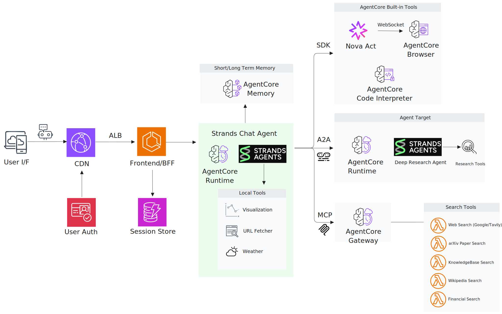
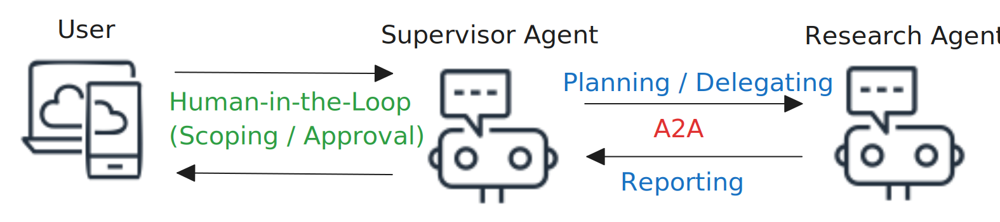

# Strands Agent Chatbot with AgentCore

Multi-agent conversational AI system powered by AWS Bedrock AgentCore and Strands Agents. Features pre-built tools and specialized agents, fully managed GenAI services reducing operational overhead, multimodal input/output support, and dynamic agent configuration through tool selection and filtering for diverse business scenarios. Deploy the entire stack with a single CDK command.

**Quick Links:** [🏗️ Architecture](#architecture) | [⚙️ Key Features](#key-features)

## Demo Videos

*All agents run on **AgentCore Runtime** with orchestration powered by **Strands Agents***

<table>
<tr>
<td width="400">
<a href="https://drive.google.com/file/d/1swDfKm6U-SmXTPtn_Y_jZ1H-9UaU_cEU/view?usp=sharing">

</a>
</td>
<td>

### 0. UI Overview

**Scenario:** Interactive demonstration of the chatbot interface, dynamic tool filtering, multi-model selection, and conversation flow with real-time streaming responses

**Features:** Tool selection sidebar • Multi-model support (20+ models) • SSE streaming • Session management • File upload for multimodal input

</td>
</tr>

<tr>
<td width="400">
<a href="https://drive.google.com/file/d/1mN62tmRPSiYv1mlYnMrwjM2nQbA4ll1_/view?usp=sharing">

</a>
</td>
<td>

### 1. Finance Assistant

**Scenario:** Analyzes FAANG stocks with real-time quotes and 3-month performance data, performs statistical analysis with visualizations, and generates comprehensive Excel reports

**Features:** Yahoo Finance API via MCP Gateway • Code Interpreter sandbox for secure execution • Chart generation and Excel document creation

</td>
</tr>

<tr>
<td width="400">
<a href="https://drive.google.com/file/d/1porEklKoxSZEZt1wNYvBjFiRUZ12fIwI/view?usp=sharing">

</a>
</td>
<td>

### 2. Travel Planning

**Scenario:** Plans a Honolulu trip by gathering travel articles, place details, route information, and weather data through interactive dialogue to help build comprehensive travel itineraries

**Features:** Google Search/Maps/Places APIs via MCP Gateway • Open-Meteo Weather API • Rich content embedding with iframe for maps and location details

</td>
</tr>

<tr>
<td width="400">
<a href="https://drive.google.com/file/d/17DfB_2evHWIiddpH3NwUlkAXLGMF8z3I/view?usp=sharing">

</a>
</td>
<td>

### 3. Agentic Web Browsing

**Scenario:** Searches for Michelin seafood restaurants in NYC, checks reservation availability, and compiles findings into a Word document with browser screenshots and key information

**Features:** AgentCore Browser with Nova Act for autonomous web automation • Live view streaming for real-time monitoring and human intervention • Word document generation via Code Interpreter

</td>
</tr>

<tr>
<td width="400">
<a href="https://drive.google.com/file/d/1uF-ZbeDemFeZ_Va1R5Fmli6P5FGzFx6r/view?usp=sharing">

</a>
</td>
<td>

### 4. Web UI Analysis

**Scenario:** Automatically inspects website UI components and functionality, analyzes service design patterns and technical implementations, captures key UI elements, and generates a comprehensive analysis report in PowerPoint

**Features:** AgentCore Browser with Nova Act for autonomous UI inspection • Live view streaming for monitoring • PowerPoint report generation via Code Interpreter

</td>
</tr>

<tr>
<td width="400">
<a href="https://drive.google.com/file/d/1bb_wtKjlZLw6RArmhg-FAEAPllTZ-1sN/view?usp=sharing">

</a>
</td>
<td>

### 5. Deep Research (Multi-Agent)

**Scenario:** Investigates Denver's real-estate market through multi-agent collaboration. Human-in-the-Loop approval for research plan and scope, then delegates to remote Research Agent via A2A protocol to gather web information with citations and visualizations

**Features:** A2A protocol for agent-to-agent communication • Remote AgentCore Runtime with Strands Research Agent • Human-in-the-Loop approval workflow • Web search with citation tracking and visualization

</td>
</tr>
</table>

## Overview

Combines Strands Agent orchestration with AWS Bedrock AgentCore services:
- **Strands Agent**: Multi-turn conversation orchestration with tool execution
- **AgentCore Runtime**: Containerized agent deployment as managed AWS service
- **AgentCore Memory**: Persistent conversation storage with user preference retrieval
- **AgentCore Gateway**: MCP tool integration with SigV4 authentication
- **AgentCore Code Interpreter**: Built-in code execution for data analysis, visualization, and chart generation
- **AgentCore Browser**: Web automation via headless browser with live view streaming
- **Amazon Nova Act**: Agentic foundation model for browser automation with visual reasoning
- **A2A Protocol**: Agent-to-Agent communication enabling Chat Agent and Research Agent to collaborate seamlessly

## Architecture



### Core Components

1. **Frontend + BFF** (Next.js)
   - Server-side API routes as Backend-for-Frontend
   - Cognito authentication with JWT validation
   - SSE streaming from AgentCore Runtime
   - Session management and file upload handling

2. **AgentCore Runtime**
   - Strands Agent with Bedrock Models
   - Uses AgentCore Memory for conversation persistence
   - Integrates with AgentCore Gateway via SigV4
   - Calls Built-in Tools via AWS API
   - Communicates with other agents via A2A protocol

3. **AgentCore Gateway**
   - MCP tool endpoints with SigV4 authentication
   - Routes requests to Lambda functions via MCP protocol
   - Tools: Google Search, Google Maps, Google Places, Wikipedia, ArXiv, Yahoo Finance, Tavily, Open-Meteo Weather

4. **AgentCore Memory**
   - Persistent conversation storage
   - Automatic history management across sessions

5. **Tool Ecosystem**
   - **Local Tools**: Web search, visualization, URL fetcher (embedded in Runtime)
   - **Built-in Tools**: AgentCore Code Interpreter for diagrams/charts/document creation (Word, Excel, PowerPoint), AgentCore Browser for automation (AWS SDK + WebSocket)
   - **Gateway Tools**: Google Search/Maps/Places, Wikipedia, ArXiv, Yahoo Finance, Tavily, Open-Meteo Weather (via AgentCore Gateway + MCP)
   - **A2A Tools**: Research Agent for comprehensive web research with markdown reports (via A2A protocol)

## Key Features

- Amazon Bedrock AgentCore Runtime
- Strands Agent Orchestration
- MCP Gateway Tools (Google Search/Maps/Places, Wikipedia, ArXiv, Yahoo Finance, Tavily, Open-Meteo)
- A2A Agent-to-Agent Protocol
- Built-in Code Interpreter for diagrams, charts, and document creation
- Multimodal I/O (Vision, Charts, Documents, Screenshots)

## Use Cases
- Financial research agent with stock analysis & SEC ingestion
- Technical research assistant using multi-agent architecture
- Web automation agent via AgentCore Browser + Nova Act
- RAG-enabled chatbot using AgentCore Memory
- Multi-protocol research assistant (MCP, A2A, AWS SDK)

## Key Technical Features

**1. Full-stack Web-based Chatbot Application**

- **Frontend**: Next.js with React, TypeScript, Tailwind CSS, shadcn/ui
- **Backend (BFF)**: Next.js API routes for SSE streaming, authentication, session management
- **Agent Runtime**: Strands Agent orchestration on AgentCore Runtime (containerized)
- **Persistence**: AgentCore Memory for conversation history and user context
- **Authentication**: AWS Cognito with JWT validation
- **Deployment**: CloudFront → ALB → Fargate (Frontend+BFF) + AgentCore Runtime

**2. Multi-Protocol Tool Architecture**

Tools communicate via different protocols based on their characteristics:

| Tool Type | Protocol | Tool Sets | Total Tools | Examples | Authentication |
|-----------|----------|-----------|-------------|----------|----------------|
| **Local Tools** | Direct function calls | 3 | 3 | Web Search, Visualization, URL Fetcher | N/A |
| **Built-in Tools** | AWS SDK + WebSocket | 5 | 25 | AgentCore Code Interpreter (Diagram, Word, Excel, PowerPoint), Browser (Nova Act) | IAM |
| **Gateway Tools** | MCP | 8+ | 20+ | Google Search/Maps/Places, Wikipedia, ArXiv, Yahoo Finance, Tavily, Open-Meteo | AWS SigV4 |
| **A2A Tools** | A2A protocol | 2 | 2 | Research Agent, Browser-Use Agent | AWS SigV4 |

Status: **50+ tools across 18+ tool sets** ✅. See [Implementation Details](#multi-protocol-tool-architecture) for complete tool list.

**3. Multi-Model Selection**

Supports 20+ foundation models from multiple providers (Anthropic, Amazon, Google, Qwen, NVIDIA, Mistral).


**4. Dynamic Tool Filtering**

Users can enable/disable specific tools via UI sidebar, and the agent dynamically filters tool definitions before each invocation, sending only selected tools to the model to reduce prompt token count and optimize costs.

**5. Token Optimization via Prompt Caching**

Implements hooks-based caching strategy with system prompt and conversation history caching to reduce input token costs. See [detailed blog post](https://medium.com/@revoir07/agent-loop-caching-the-missing-optimization-for-agent-workflows-230cc530eb72) for implementation details.

**6. Multimodal Input/Output**

Native support for visual and document content:
- **Input**: Images (PNG, JPEG, GIF, WebP), Documents (PDF, CSV, DOCX, etc.)
- **Output**: Charts from AgentCore Code Interpreter, screenshots from AgentCore Browser

**7. Two-tier Memory System**

Uses AgentCore Memory for session-based conversation history (short-term) and summarization (long-term). Implements [compaction algorithm](https://medium.com/@revoir07/long-context-compaction-for-ai-agents-part-1-design-principles-2bf4a5748154) for context retention in long conversations.

**8. Multi-agent Architecture**

The system implements a **Supervisor-Worker pattern** using A2A (Agent-to-Agent) protocol, enabling specialized agents to handle complex tasks independently while maintaining human oversight.

### Example: Research Agent Workflow



**Key Components:**

- **Supervisor Agent**: Main conversational interface that plans tasks, requests user approval, and delegates to specialized agents
- **Research Agent (A2A)**: Autonomous research specialist that executes approved plans using web search, Wikipedia, and generates markdown reports with charts
- **Human-in-the-Loop**: Strands Interrupt mechanism for user approval before delegating tasks
- **A2A Protocol**: AgentCore-managed communication enabling seamless cross-agent collaboration

**Benefits:**
- **Modularity**: Add specialized agents without modifying the supervisor
- **Human Control**: Approval workflow ensures oversight of autonomous operations
- **Scalability**: Each agent runs on independent AgentCore Runtime
- **Flexibility**: Agents can be updated, scaled, or replaced independently

## Implementation Details

### Multi-Protocol Tool Architecture

See [docs/TOOLS.md](docs/TOOLS.md) for detailed tool specifications.

| Tool Name | Protocol | API Key | Status | Description |
|-----------|----------|---------|--------|-------------|
| **Local Tools** | | | | |
| Web Search | Direct call | No | ✅ | DuckDuckGo search |
| Visualization Creator | Direct call | No | ✅ | Interactive charts (Plotly) |
| URL Fetcher | Direct call | No | ✅ | Web content extraction |
| **Built-in Tools** | | | | |
| Diagram Generator | AWS SDK | No | ✅ | Charts/diagrams via AgentCore Code Interpreter |
| Browser Automation (6 tools) | AWS SDK + WebSocket | Yes | ✅ | Navigate, action, extract, screenshot via AgentCore Browser (Nova Act) |
| Word Document Tools (4 tools) | AWS SDK | No | ✅ | Create, modify, list, read Word documents via Code Interpreter |
| PowerPoint Tools (10 tools) | AWS SDK | No | ✅ | Create, modify, list, read, add/edit slides in PowerPoint presentations via Code Interpreter |
| Excel Spreadsheet Tools (4 tools) | AWS SDK | No | ✅ | Create, modify, list, read Excel spreadsheets via Code Interpreter |
| **Gateway Tools** | | | | |
| Google Search (2 tools) | MCP | Yes | ✅ | Web and image search |
| Google Maps (incl. Map Viewer) | MCP | Yes | ✅ | Location, route information, interactive map display with markers and directions |
| Google Places | MCP | Yes | ✅ | Place details and recommendations |
| Wikipedia (2 tools) | MCP | No | ✅ | Article search and retrieval |
| ArXiv (2 tools) | MCP | No | ✅ | Scientific paper search |
| Yahoo Finance (4 tools) | MCP | No | ✅ | Stock quotes, history, news, analysis |
| Tavily AI (2 tools) | MCP | Yes | ✅ | AI-powered search and extraction |
| Open-Meteo Weather | MCP | No | ✅ | Current weather and forecast data |
| **A2A Tools** | | | | |
| Research Agent | A2A protocol | No | ✅ | Comprehensive web research with markdown reports and citations |
| Browser-Use Agent | A2A protocol | No | ✅ | Autonomous browser automation with AI-driven adaptive navigation |

**Protocol Details:**
- **Direct call**: Python function with `@tool` decorator, executed in runtime container
- **AWS SDK**: Bedrock client API calls (AgentCore Code Interpreter, AgentCore Browser)
- **WebSocket**: Real-time bidirectional communication for browser automation
- **MCP**: Model Context Protocol (via AgentCore Gateway with SigV4 authentication)
- **A2A protocol**: Agent-to-Agent communication with AWS SigV4 authentication for runtime-to-runtime collaboration

**Total: 50+ tools across 18+ tool sets** (50+ ✅)

### Dynamic Tool Filtering

**Implementation:** `agent.py:590-652`

```python
# User-selected tools from UI sidebar
enabled_tools = ["web_search", "gateway_wikipedia-search___wikipedia_search"]

# Filters applied before agent creation
agent = Agent(
    model=model,
    tools=get_filtered_tools(enabled_tools),  # Dynamic filtering
    session_manager=session_manager
)
```


**Flow:**
1. **User Toggle**: User selects tools via UI sidebar
2. **Enabled Tools**: Frontend sends enabled tool list to AgentCore Runtime
3. **Tool Filtering**: Strands Agent filters tools before model invocation
4. **Invoke**: Model receives only enabled tool definitions
5. **ToolCall**: Agent executes local or remote tools as needed

**Benefits:**
- Reduced token usage (only selected tool definitions sent to model)
- Per-user customization
- Real-time tool updates without redeployment

### Token Optimization: Prompt Caching

Implements prompt caching via Strands hooks. See [blog post](https://medium.com/@revoir07/agent-loop-caching-the-missing-optimization-for-agent-workflows-230cc530eb72) for details.

## Quick Start

### Prerequisites

- **AWS Account** with Bedrock access
- **AWS CLI** configured with credentials
- **Docker** installed and running
- **Node.js** 18+ and **Python** 3.13+
- **AgentCore** enabled in your AWS account region

### Local Development

Run the application locally with Docker Compose:

```bash
# 1. Clone repository
git clone https://github.com/aws-samples/sample-strands-agent-with-agentcore.git
cd sample-strands-agent-with-agentcore

# 2. Setup dependencies
cd chatbot-app
./setup.sh

# 3. Configure AWS credentials
cd ../agent-blueprint
cp .env.example .env
# Edit .env with your AWS credentials and region

# 4. Start all services
cd ../chatbot-app
./start.sh
```

**Services started:**
- Frontend + BFF: http://localhost:3000
- Agent Backend: http://localhost:8000
- Local file-based session storage

**What runs locally:**
- ✅ Frontend (Next.js)
- ✅ AgentCore Runtime (Strands Agent)
- ✅ Local Tools (3 tools)
- ✅ Built-in Tools (Code Interpreter, Browser via AWS API)
- ❌ AgentCore Gateway (requires cloud deployment)
- ❌ AgentCore Memory (uses local file storage instead)

### Cloud Deployment

Deploy the full-stack application to AWS using the interactive deployment script:

```bash
# Navigate to deployment directory
cd agent-blueprint

# Run deployment script
./deploy.sh
```

The deployment script provides the following options:

1. **AgentCore Runtime** - Agent container on Bedrock AgentCore with Strands Agent orchestration
2. **Frontend + BFF** - Next.js application with CloudFront CDN, ALB, and Cognito authentication
3. **MCP Tools** - AgentCore Gateway with Lambda functions (Google, Wikipedia, ArXiv, Finance, etc.)
4. **AgentCore Runtime A2A** - Research Agent and Browser-Use Agent with A2A protocol
5. **Runtime + Frontend** - Combined deployment of options 1 + 2
6. **Full Stack** - Complete deployment of all components (Runtime + Frontend + Gateway + A2A)

The script will guide you through:
- AWS region selection
- Component selection
- Automatic dependency installation and deployment

## Project Structure

```
sample-strands-agent-chatbot/
├── chatbot-app/
│   ├── frontend/              # Next.js (Frontend + BFF)
│   │   └── src/
│   │       ├── app/api/       # API routes (BFF layer)
│   │       ├── components/    # React components
│   │       └── config/        # Tool configuration
│   └── agentcore/             # AgentCore Runtime
│       └── src/
│           ├── agent/         # ChatbotAgent + session management
│           ├── local_tools/   # Web search, visualization, URL fetcher
│           ├── builtin_tools/ # Code Interpreter and Browser tools
│           └── routers/       # FastAPI routes
│
└── agent-blueprint/
    ├── chatbot-deployment/    # Main app stack (Frontend+Runtime)
    ├── agentcore-gateway-stack/   # Gateway + Lambda functions
    ├── agentcore-runtime-stack/   # Runtime deployment (shared)
    └── agentcore-runtime-a2a-stack/   # Research Agent (A2A)
```

## Documentation

- [DEPLOYMENT.md](DEPLOYMENT.md): Detailed deployment instructions

## Support

- **Issues**: [GitHub Issues](https://github.com/aws-samples/sample-strands-agent-with-agentcore/issues)
- **Troubleshooting**: [docs/guides/TROUBLESHOOTING.md](docs/guides/TROUBLESHOOTING.md)

## License

MIT License - see LICENSE file for details.

